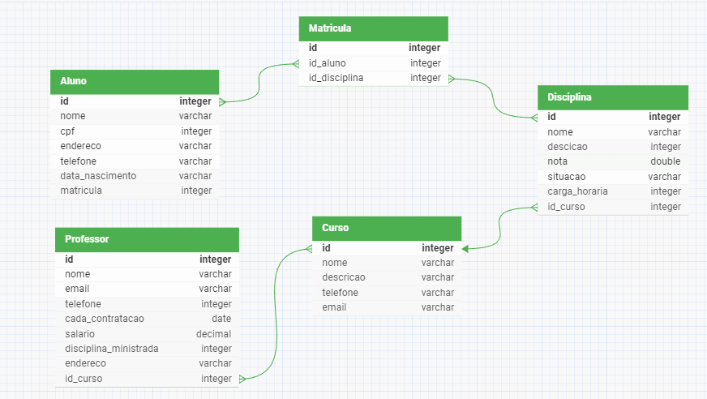

## GUIA PARA EXECUÇÃO 
<ol>
  <li>Instale o Python</li>
  <li> Crie um ambiente virtual (venv) - utilizando terminal do seu sistema operacional ou IDE (Vscode)</li>
  <li> Baixa os arquivos da pasta projeto_final_cyberedux salve em uma pasta do computador </li>
  <li> Ative o ambiente virtual (venv)</li>
  <li> Instale o framework Django dentro do ambiente virtual executando o seguinte comando pip install django </li>
  <li> Depois de instalado o framework, pelo terminal navegue ate a pasta projeto_final</li>
  <li> Inicialize o servidor do app execute o seguinte comando py manage.py runserver</li>
  <li> Aposinicilizar o servidor copie o endereço ip que sera fornecido e cole no navegador (normalemente é apresentado o endereço http://127.0.0.1:8000/)</li>
</ol>

## Modelagem de banco de dados

