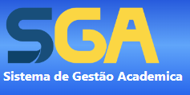

<!-- Adicione Badges das tecnologias que você usou aqui -->
<!-- Você pode encontrar badges aqui: https://github.com/Ileriayo/markdown-badges?tab=readme-ov-file#markdown-badges -->

**Este projeto foi desenvolvido como atividade final do curso de capacitação em Python da Cyber Edux, realizado de setembro de 2023 até março de 2024. Para mais informações.

# SGA - Sistema de Gestão Academica

<!-- Substitua a seguinte imagem por uma logo do seu projeto -->

<!-- Substitua o seguinte parágrafo por um resumo do seu projeto: -->
O sistema de gestão acadêmica é uma plataforma tecnológica projetada para facilitar a administração e o gerenciamento das atividades relacionadas às instituições de ensino, como escolas, faculdades e universidades. Aqui estão algumas das principais funcionalidades que esse sistema de gestão acadêmica oferece:
<ol>
  <li>Registro de Alunos</li>
  <li>Gestão de Professores</li>
  <li>Gestão de Cursos e Disciplinas</li>
  <li>Controle de Matrículas</li>
  <li>Acesso Seguro</li>
</ol>

## Documentação

* [Documentação (para desenvolvedores)](DOCUMENTACAO.md)
* [Manual (para usuários)](MANUAL.md)

